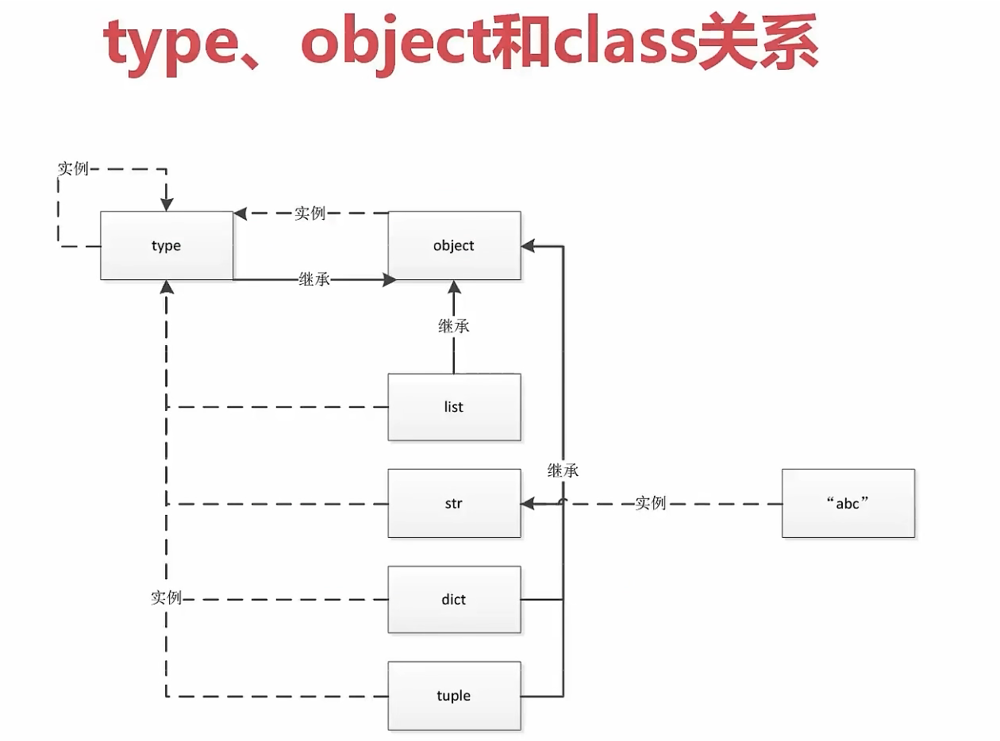

## python一切皆对象

### 1. 一切皆对象
**python中一切皆对象更加彻底**

1. 类和实例对象
2. 可以认为类是实例的一个模板
3. 函数也是一个对象
4. python中函数也可以返回函数

### 2. type、object、class关系

类是由type这个类生成的一个对象  
平常熟悉的对象是由类生成的对象  
object是所有类都要继承的基础类  
——type是类型实例关系的顶端，所有对象都是它的实例
——object是父子关系的顶端，所有数据类型的父类都是它  
详细可参考：[如何理解python中一切皆对象呢？看type，object，class的关系](https://zhuanlan.zhihu.com/p/100885824)


### 3. python对象常见的内置类型
1. 对象的三个特征：身份、类型、值
    - 身份：所有对象都有一个唯一的身份标识自己，通过id()得到
    - 类型：对象的类型决定了对象可以保存什么类型的值，有哪些属性和方法，可以进行哪些操作，遵循怎样的规则
    - 值：对象所表示的数据
2. None 全局中只有一个，一个对象为None，则指向None
3. 数值类型：int , float, complex, bool
4. 迭代类型
5. 序列类型：list, (二进制序列), range, tuple, str, array
6. 映射(dict)
7. 集合: set, frozenset
8. 上下文管理类型：with语句
9.  其他类型
**注：dict和set实现原理是比较相似的，运行起来会快**

### 4.对象的创建和引用
```python
a = 3
```
简单来看，上边的代码执行了以下操作：
- 如果变量 a 不存在，创建一个新的变量 a
- 将变量 a 和数字 3 进行连接，即 a 成为对象 3 的一个引用
    - 从内部来看，变量是到对象的内存空间的一个指针，尤其注意：变量总是连接到对象，而不会连接到其他变量  
    - 从概念上可以这样理解，对象是堆上分配的一个内存空间，用来表示对象所代表的值；变量是一个系统创建的表中的元素，拥有指向对象的引用；引用是从变量到对象的指针。
    - 从技术上来说，每一个对象有两个标准的头部信息，一个类型标识符来标识类型，还有一个引用的计数器，用于决定是否需要对对象进行回收。这里还涉及到对象的一种优化方法，Python 缓存了某些不变的对象对其进行复用，而不是每次创建新的对象。

### 5. 共享引用
在 Python 中变量都是指向某一对象的引用，当多个变量都引用了相同的对象，成为共享引用。
```python
a = 1
b = a
a = 2
b
# 这里会输出b = 1
```
但对于像列表这种可变对象来说则不同

```python
a = [1, 2, 3]
b = a
a[0] = 0
a
# 这里输出[0, 2, 3]
b
# 这里输出[0, 2, 3]
```
由于列表的这种可变性，在代码执行某些操作时可能出现一些意外，因此需要对其进行拷贝来保持原来的列表

### 6. 对象相等
== 操作用于测试两个被引用对象的值是否相等  
is 用于比较两个被引用的对象是否是同一个对象
```python 
a = [1, 2, 3]
b = a
a is b
# 输出True
a = [1, 2, 3]
b = [1, 2, 3]
a is b
# 输出False
```
但是当操作对象为一个较小的数字或较短的字符串时，又有不同：
```python
a = 7
b = 7
a is b
# 输出True
```
这是由于 Python 的缓存机制造成的，小的数字和字符串被缓存并复用，所以 a 和 b 指向同一个对象

### 小结
**<font size=4>python 动态语言，面向对象更加彻底，同时高度的灵活性也使其失去了静态语言的严谨性；一切皆对象使得代码没有编译过程，错误只有在代码运行起来的时候才能发现</font>**
