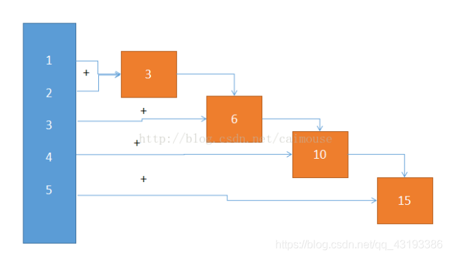

## Map, Filter, Reduce

### Map
map会将一个函数映射到一个输入列表的所有元素上，这是它的规范

    map(function_to_apply, list_of_inputs)

下面是一个map简化和漂亮代码的demo
```python
# 平常情况
items = [1, 2, 3, 4, 5]
squared = []
for i in items:
    squared.append(i**2)
# 使用map
items = [1, 2, 3, 4, 5]
squared = list(map(lambda x: x**2, items))
```
大多数时候，我们使用匿名函数(lambdas)来配合map, 所以我在上面也是这么做的。 不仅用于一列表的输入， 我们甚至可以用于一列表的函数！
```python
def multiply(x):
        return (x*x)
def add(x):
        return (x+x)

funcs = [multiply, add]
for i in range(5):
    value = map(lambda x: x(i), funcs)
    print(list(value))
    # 译者注：上面print时，加了list转换，是为了python2/3的兼容性
    #        在python2中map直接返回列表，但在python3中返回迭代器
    #        因此为了兼容python3, 需要list转换一下

# Output:
# [0, 0]
# [1, 2]
# [4, 4]
# [9, 6]
# [16, 8]
```


### Filter
过滤列表中的元素，并且返回一个由所有复合要求的元素所构成的列表，复合要求即映射到该元素时返回值为True
```python
number_list = range(-5, 5)
less_than_zero = filter(lambda x: x < 0, number_list)
print(list(less_than_zero))  
# 译者注：上面print时，加了list转换，是为了python2/3的兼容性
#        在python2中filter直接返回列表，但在python3中返回迭代器
#        因此为了兼容python3, 需要list转换一下

# Output: [-5, -4, -3, -2, -1]
```


### Reduce
需要对一个列表进行计算并返回结果reduce

```python
from functools import reduce
result = reduce(lambda x, y: x+y, [1, 2, 3, 4, 5]) 
print(result)
# output
# 15
```
下图时展示的过程
